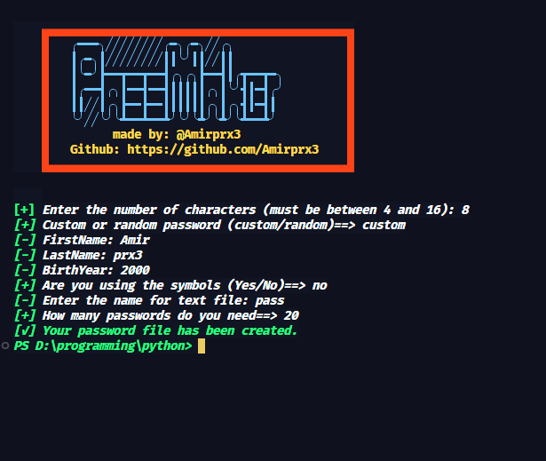

# Password Generator

This project is a simple Python script to generate random or custom passwords and save them to a text file.

## Features

- Generate passwords with custom or random combinations.
- Option to include special symbols (`!@#$%^&*?`).
- Password length can be set between 4 and 16 characters.
- Saves generated passwords into a text file.
- Includes input validation for names and year of birth in custom mode.

## How it Works

1. **Select Password Length**: The user can choose the length of the password (between 4 and 16 characters).
2. **Custom or Random Password**: The user decides whether to generate a custom password (based on first name, last name, and birth year) or a fully random one.
3. **Special Symbols**: In custom mode, the user can choose to include special symbols like `!@#$%^&*?`.
4. **Multiple Passwords**: The user can specify how many passwords they want to generate.
5. **Save to File**: Passwords are saved to a `.txt` file, as named by the user.

## Usage

To run this script, follow these steps:

1. **Clone the repository**:
    ```bash
    git clone https://github.com/Amirprx3/password-generator.git
    cd password-generator
    ```

2. **Run the script**:
    ```bash
    python3 password_generator.py
    ```

3. **Follow the prompts**:
    - Enter the number of characters for the password.
    - Choose between a custom or random password.
    - In custom mode, provide your first name, last name, and birth year.
    - Optionally choose to include special symbols.
    - Specify how many passwords you need.
    - The generated passwords will be saved in the file with the name you specify.

## Example Output

## Requirements

- Python 3.x
- `time` module (standard library)
- `random` module (standard library)

## Author

- **Amirprx3** - [GitHub](https://github.com/Amirprx3)


# License
This project is licensed under the MIT License.
